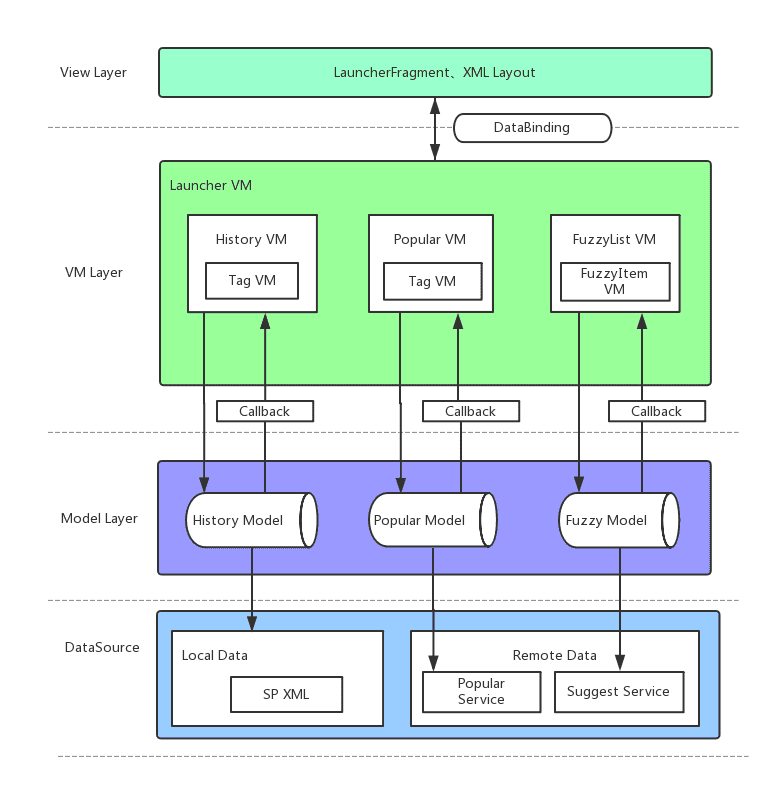
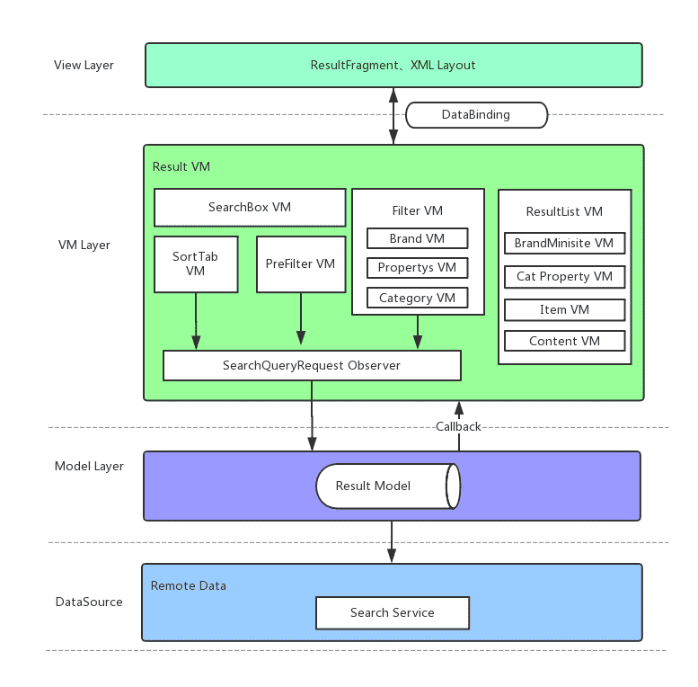

### 前言

软件开发过程中为了提高代码的可维护性、可扩展性、减少依赖耦合，往往会遵循某种编程模式进行代码的编写。目前Android应用开发中较流行的编程模式有MVC、MVP、MVVM三种。
- MVC模式会使得Activity/Fragment臃肿庞大，并且Controller和View耦合较深。
- MVP模式虽然引入Presenter解耦了视图操作和业务逻辑，但是Presenter会持有View层的抽象接口，接口粒度不好把握，而且需要手动调用接口才能实现UI响应，还要关心View层对象是否被销毁。
- MVVM模式引入了ViewModel的概念用来处理对应的View层的业务逻辑，并借助DataBinding技术实现视图和数据的双向绑定，这也正好解决了MVP模式的弊端。
业务不复杂的时候MVC和MVP模式都可以满足。天猫进口App搜索功能的结果展示页包含排序、结果筛选、结果集，并且有较为复杂的用户交互过程，能否做好层次划分和模块组件化，直接影响到以后的扩展和维护成本。基于此，我采用了MVVM模式来实现。

### 设计

一个拥有搜索功能的APP在产品设计上一般包括以下三个方面：搜索入口、启动页、结果页。假设APP的搜索入口在首页的ActionBar位置，进入首页的时候需要从服务端请求底纹信息展示在搜索入口，底纹可以是运营干预词也可以是个性化推荐词。点击搜索入口即进入启动页，把底纹带入启动页。启动页可以接收用户的输入，还包含输入联想词列表、历史记录和热搜词推荐。结果页由排序栏、外透筛选栏、内置筛选、结果集列表组成。为了做到模态切换，分别用两个fragment来承载启动页和结果页，下面介绍下启动页和结果页的MVVM结构是如何设计的。

- 启动页的MVVM结构：

Launcher VM包含了三个Child VM：Histroy VM、Popular VM、Fuzzy VM，这三个VM对应的View都允许用户操作跳往搜索结果页。为了做到VM对View层的无感知，各个Child VM负责操作Observer对象，LauncherFragment观察这个对象的属性变化并作出跳转的响应，这需要Launcher VM维护这个可观察的对象，并把它传给三个Child VM。

- 结果页的MVVM结构：

Result VM主要包含：SearchBox VM、ResultList VM、SortTab VM、PreFilter VM、Filter VM，这五个Child VM，其中SortTab VM、PreFilter VM、Filter VM会持有Result VM的Request Observer。在与服务端定义搜索接口时，约定了服务端对排序类型和筛选项增加selected字段记录当前结果集的query选择了哪些条件，这样客户端就不用做本地状态保存，只要根据selected字段渲染组件的选中和非选中状态。在MVVM模式中，要把页面的各个模块组件化，每个组件有对应的VM，当用户有操作行为发生的时候，这些Child VM可以更改自己负责的请求参数，Request Observer观察到数据的变化会发起新的搜索请求，然后根据服务端返回的数据通知各个Child VM更新对应的View。

另外，两个页面都创建了不是用来做UI展示的Fragment持有页面的顶级VM，使得它不随着View组件生命周期的销毁而销毁。通过这样的模式设计，Fragment里的代码量较少，把业务逻辑规划到各个Child VM分而治之，并且这些Child VM是可进行单元测试的，也使得将来的功能扩展更加方便。

### 参考
[DataBinding](https://blog.csdn.net/u011897062/article/details/82185027)

