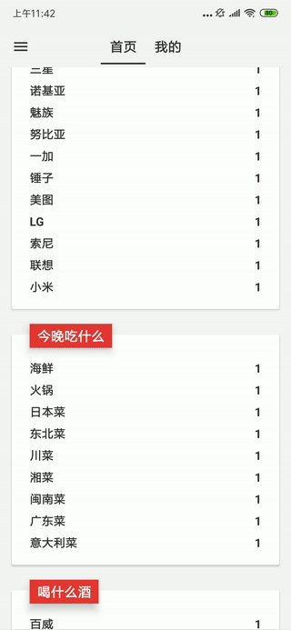

在我的SideProject中有这样一个场景，使用RecyclerView和CardView的组合实现一个展示列表，其中CardView有subItem，每个CardView的subItem个数可能不一样，subItem包括name和weight两个value，分别靠左、靠右对齐。效果如下：



用TextView结合String换行无法实现weight value靠右对齐。用CardView嵌套ListView又显得太重，还有性能问题。分析下来，更合理的做法是自定义一个View实现。

Android的自定义View控件可以分为三种：组合式、继承式、自绘式，这个场景适合用自绘式实现。分享下代码：

```Java

public class OptionsTextView extends View {

    private TextPaint mContentPaint;

    private List<RouletteModel.Item> mOptionList;

    private float mLineSpace;

    private int mSingleTextHeight;

    private Rect mBounds;

    private float mTextSize;

    // spacing between name and weight
    private float mSpacing;

    public OptionsTextView(Context context) {
        this(context,null);
    }

    public OptionsTextView(Context context, AttributeSet attrs) {
        this(context, attrs,0);
    }

    public OptionsTextView(Context context, AttributeSet attrs, int defStyleAttr) {
        super(context, attrs, defStyleAttr);

        // 也可以自定义属性，在xml中传入
        mLineSpace = getResources().getDimension(R.dimen.roulette_spacing_smaller);
        mSpacing = getResources().getDimension(R.dimen.roulette_spacing_normal);
        mTextSize = getResources().getDimension(R.dimen.roulette_font_normal);

        mBounds = new Rect();

        mContentPaint = new TextPaint();
        mContentPaint.setTextSize(mTextSize);
        mContentPaint.setAntiAlias(true);
        mContentPaint.setColor(context.getResources().getColor(R.color.roulette_black));
        mContentPaint.setTypeface(Typeface.defaultFromStyle(Typeface.BOLD));

        // 计算文字的高度
        Paint.FontMetricsInt fm = mContentPaint.getFontMetricsInt();
        mSingleTextHeight = Math.abs(fm.top - fm.bottom);
    }

    /**
     * 这个自定义View作为RecyclerView的item，当复用时由于dataList的数据改变，高度可能有变化，
     * 所以需要调用requestLayout，而不是invalidate，requestLayout会请求布局，invalidate只会重绘
     *
     * @return
     */
    public void addOptionList(List<RouletteModel.Item> dataList) {
        mOptionList = dataList;

        requestLayout();
    }

    @Override
    protected void onMeasure(int widthMeasureSpec, int heightMeasureSpec) {
        super.onMeasure(widthMeasureSpec,heightMeasureSpec);
        setMeasuredDimension(getMeasuredWidth(), (int)getViewHeight());
    }

    /**
     * 根据OptionList计算View的高度
     *
     * @return
     */
    private float getViewHeight() {
        return mSingleTextHeight * mOptionList.size() + mLineSpace * (mOptionList.size() - 1) + getPaddingBottom() + getPaddingTop();
    }

    @Override
    protected void onDraw(Canvas canvas) {
        if (mOptionList == null) {
            return;
        }

        for (int i = 0; i < mOptionList.size(); i++) {
            // 先画右边的权重文字区域
            String weight = String.valueOf(mOptionList.get(i).weight);
            mContentPaint.setTextSize(mTextSize);
            mContentPaint.setTextAlign(Paint.Align.RIGHT);
            canvas.drawText(weight, getMeasuredWidth() - getPaddingRight(), getPaddingTop() + mSingleTextHeight * (i + 1) + mLineSpace * i, mContentPaint);

            // 再画左边的选项文字区域
            String name = mOptionList.get(i).name;
            float totalWidth = mContentPaint.measureText(mOptionList.get(i).name + weight) + mSpacing;
            // 如果超出总长度超出绘制区域宽度
            if (totalWidth >= getMeasuredWidth() - getPaddingLeft() - getPaddingRight()) {
                // 算出选项文字区域可用的宽度，注意为了美观两者之间有个间距
                mContentPaint.getTextBounds(weight, 0, weight.length(), mBounds);
                float desiredWidth = getMeasuredWidth() - getPaddingLeft() - getPaddingRight() - mBounds.width() - mSpacing;

                mContentPaint.getTextBounds(name, 0, name.length(), mBounds);
                float desiredTextSize = mTextSize * desiredWidth / mBounds.width();
                mContentPaint.setTextSize(desiredTextSize);
            }

            mContentPaint.setTextAlign(Paint.Align.LEFT);
            canvas.drawText(name, getPaddingLeft(), getPaddingTop() + mSingleTextHeight * (i + 1) + mLineSpace * i, mContentPaint);
        }
    }
}

```